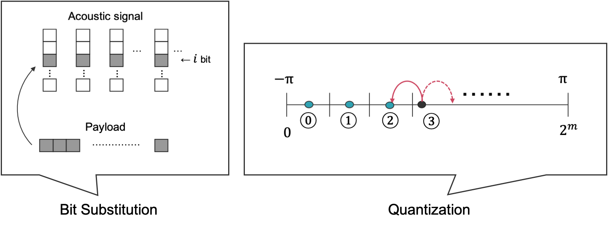
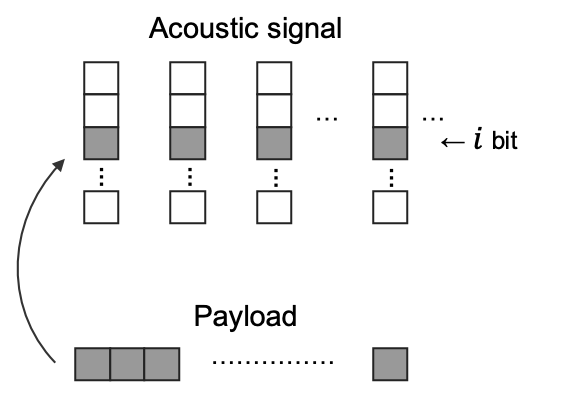
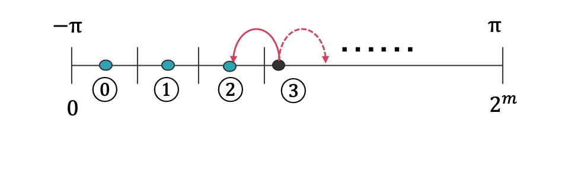

# data_hiding
<div align="center">

</div>
In this repository, we publish the basic algorithm for data hiding.

<br>

# Description
The main contents are two types: bit substitution and quantization. In bit substitution, some of the bits in cover data are replaced by the pyload. This type of approach can treat lots of data, but it is not tolerant of atacks such as sompressions. In quantization, depend on how to make a secret key, it can have a wider variation of embedding. However, as bit substitiution it does not have resistance for some attacks.

<br>

# Usage
## Bit substitution
<div align="center">

</div>

Note:
- The input cover data is assumed to be **2D**.
- The cover data is **complex numbers**.
- The payload is embedded on **the phase** of the cover data.

<br>

### Embed
```
$ python bs_embed.py [path_to_cocer_data] [path_to_payload] [LSB] [MSB] [division_number]
```

<br>

Arguments:  
1. A path to the cover data by ndarray.
2. A path to the payload you have prepared by ndarray.
3. LSB which you want to embed.
4. MSB which you want to embed.
5. A number which you want to divide.


Return:
- Steg spectrogram, which is embedded payload into cover data. (steg_data_bs.npy)

Note:
- The cover data is assumed to be 2D.

<br>

### Extract
```
$ python bs_extract.py [path_to_steg_data] [length_of_payload] [LSB] [MSB] [division_number]
```

<br>

Arguments:  
1. A path to the steg data by ndarray.
2. A length of the payload you have prepared by ndarray.
3. LSB which you want to embed.
4. MSB which you want to embed.
5. A number which you want to divide.


Return:
- Extracted data (extracted_data_bs.npy)

<br>

### Check (Caliculate bit error rate and Accuracy)
```
$ python check.py [path_to_payload] [extracted data]
```

<br>

Arguments:  
1. A path to the payload by ndarray.
2. A path to the extracted data.


Standard return:
- Bit error rate (BER)
- Accuracy (1 - BER)

<br>

## Quantization
<div align="center">

</div>

### Embed
```
$ python qz_embed.py [path_to_cocer_data] [path_to_payload] [division_number]
```

<br>

Arguments:  
1. A path to the cover data by ndarray.
2. A path to the payload you have prepared by ndarray.
3. A number which you want to divide.


Return:
- Steg spectrogram, which is embedded payload into cover data. (steg_data_qz.npy)

Note:
- The cover data is assumed to be 2D.

<br>

### Extract
```
$ python qz_extract.py [path_to_steg_data] [length_of_payload] [division_number]
```

<br>

Arguments:  
1. A path to the steg data by ndarray.
2. A length of the payload you have prepared by ndarray.
3. A number which you want to divide.


Return:
- Extracted data (extracted_data_qz.npy)

<br>

### Check (Caliculate bit error rate and Accuracy)
Please refer to the above section "Check".
